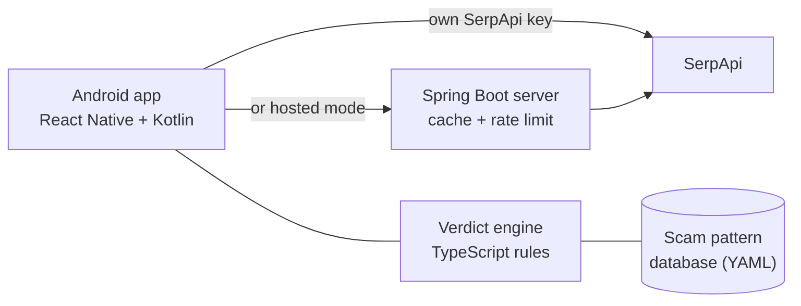

# NoTopi

**Is this a scam? Paste it, share it, or screenshot it, and get an answer with proof.**

*Topi pehnana* (Hindi slang): to con someone. **NoTopi**: not today.

NoTopi is an open-source Android app that checks messages, phone numbers, links, apps and shop
names for scams common in India. It doesn't just say "spam": it tells you **which scam** it looks
like, **why** (with the exact words and web reports highlighted), and **what to do next**.

<!--
  SCREENSHOTS: drag each image from S:\notopi-screenshots onto the matching line below,
  then delete the placeholder text. GitHub turns each drop into an  tag.
-->

| Share from any app | The verdict | Why it's a scam |
|:---:|:---:|:---:|
| DROP 0-share-sheet.png HERE | DROP 2-verdict-scam.png HERE | DROP 3-verdict-why.png HERE |

| Home | Suspicious link | What to do |
|:---:|:---:|:---:|
| DROP 1-home.png HERE | DROP 4-verdict-suspicious.png HERE | DROP 5-help.png HERE |

## What it checks

| You give it | NoTopi looks for |
|---|---|
| **A message** (SMS, WhatsApp) | Known scam scripts, the structure of a scam, and reports of the number it asks you to call |
| **A phone number** | Web reports, complaint sites and police warnings that name it; a matching Google business listing |
| **A link** | Look-alike brand domains (`sbi-kyc-update.xyz`), risky endings, short links, `.apk` downloads, and reports |
| **A shop or website name** | Reddit and complaint-site reports, however the name is spaced ("Bling Queen" = "blingqueen") |
| **An app** (Play Store link or package) | Age, developer details, and Play reviews describing harassment |
| **A screenshot** | Reads the text on the phone, then checks it like a message |

Three ways to use it: paste into the app, **long-press a message → Share → NoTopi**, or select any
text → **⋮ → NoTopi**.

## How it decides

Every verdict is built from **signals**: small, explainable rules that each add or remove points,
with the evidence shown as a receipt. No black box.

1. **Scam scripts.** A community-maintained database of Indian scams (digital arrest, KYC update,
   electricity cut-off, task jobs, SIR voter list, loan-app harassment and more), each with the
   phrases scammers use and what to do. → [`patterns/`](patterns)
2. **Scam anatomy.** New scams change the story, not the structure: they claim authority, add a
   threat or a prize, push you off official channels, and ask for money or an OTP. A message with
   that shape is flagged even if nobody has written a rule for it yet. The strongest tell: *claims
   to be a government body or bank but gives a personal mobile number.*
3. **Live web and police evidence.** Through [SerpApi](https://serpapi.com), NoTopi searches the web
   and **police and government sites** (`gov.in`, `nic.in`, police accounts on X) for reports of the
   number, link or name. An official warning is the strongest single signal.

Points add up to a risk score: **Scam** (60+), **Suspicious** (30+), and **Looks clean** only with
positive proof, such as an official domain or a matching business listing. With no evidence either
way, it honestly says **Can't tell yet**.

## Privacy

- No account, no contacts upload, no tracking.
- Screenshots are read **on the phone** with ML Kit; images never leave the device.
- Your SerpApi key is stored in encrypted storage on the phone.
- History stays on the phone.

## Architecture



| Part | Tech | What it does |
|---|---|---|
| [`apps/mobile`](apps/mobile) | React Native (Expo), TypeScript | Screens, history, settings, search calls |
| [`apps/mobile/modules`](apps/mobile/modules) | **Kotlin** (Expo Modules API) | Share and text-selection intents, ML Kit OCR |
| [`packages/engine`](packages/engine) | TypeScript, Vitest | Classifies input, plans searches, scores evidence into a verdict |
| [`apps/server`](apps/server) | Java 21, Spring Boot 4 | Optional proxy that keeps the key server-side, caches searches for everyone, rate-limits per device |
| [`patterns`](patterns) | YAML | Scam scripts, brand domains, official sources, scam anatomy |

### Android (Kotlin)

- [`ShareIntentModule.kt`](apps/mobile/modules/share-intent/android/src/main/java/app/notopi/share/ShareIntentModule.kt):
  handles `ACTION_SEND` (text and images) and `ACTION_PROCESS_TEXT` (the text-selection menu), on
  launch and through `onNewIntent` when the app is already open.
- [`TextRecognizerModule.kt`](apps/mobile/modules/text-recognizer/android/src/main/java/app/notopi/ocr/TextRecognizerModule.kt):
  reads screenshots with ML Kit's bundled model, offline, from the shared `content://` URI.
- [`withShareIntent.js`](apps/mobile/plugins/withShareIntent.js): a config plugin that adds the
  intent filters and `singleTask` launch mode to the generated manifest.

The `android/` folder itself is generated by Expo (`npx expo prebuild`), so the repo only contains
native code that was written by hand.

### Search budget

The free SerpApi plan has 250 searches a month, so each check uses about **two** (one web search,
one police/government search), messages that are already a clear scam from their wording use
**none**, and results are cached for a day on the phone and on the server.

## Run it

**You need:** Node 20+, Android Studio (for the SDK and its JDK 21), and a phone with USB debugging.
A [free SerpApi key](https://serpapi.com/users/sign_up) is optional: without one, NoTopi still
checks the wording of messages and links.

```bash
npm install
npm test                      # verdict engine tests
```

**App** (a development build, because of the Kotlin modules):

```bash
cd apps/mobile
npx expo run:android          # builds, installs and starts Metro
```

Then add your SerpApi key in **Settings**, or point it at a server.

**Server** (optional):

```bash
cd apps/server
SERPAPI_KEY=your_key ./gradlew bootRun     # Windows: set SERPAPI_KEY=... && gradlew.bat bootRun
```

In the app, set **Settings → NoTopi server** to `http://<your-computer's-IP>:8080`.

## Add a scam

New scams appear every month. If you've received one NoTopi misses, add it to the database: copy a
file in [`patterns/in`](patterns/in), fill in the phrases and advice, and open a pull request.
[`patterns/README.md`](patterns/README.md) explains each field. Tests check every file, and the
app picks up the database on its next build.

## Built for

The [SerpApi India Hackathon 2026](https://serpapi.github.io/serpapi-india-hackathon-2026/),
Knowledge & Public Interest track.

## Licence

[MIT](LICENSE)
